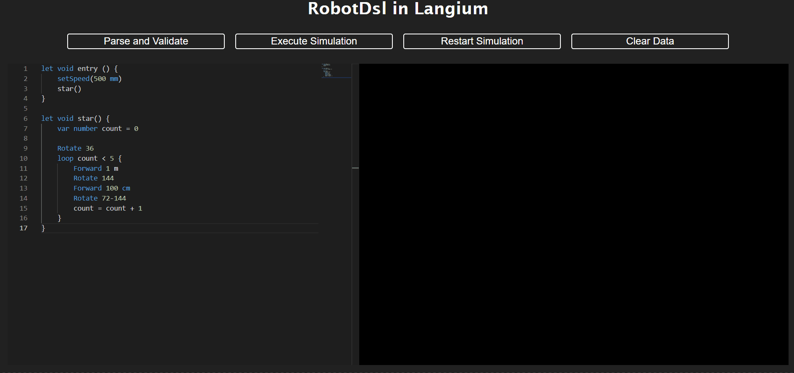
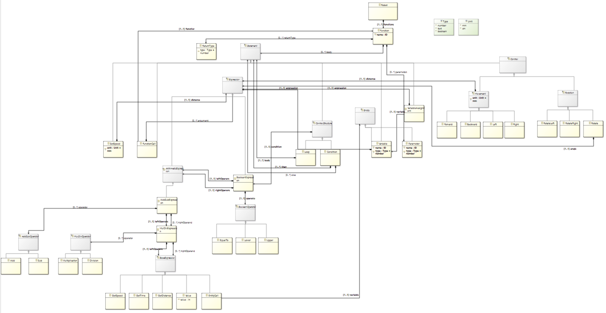

# Robot-dsl

This repository creates a domain-specific language (DSL) to define the behaviour of a robot, from domain modelling to implementation, and then interprets it on a web simulator and compiles it into Arduino code for execution on the robot.

Here is an example of a simulation of a program in our robot-dsl language :



## Domain modeling with Ecore

To define the language, we created an Ecore metamodel. Here is our domain model :



Our DSL Robot allows you to control the robot by moving it in 4 directions: `Forward`, `Backward`, `Left` and `Right` and by rotating it with `Rotate`. Control structures are also available with `loop` for creating while loops and `if` for creating conditions. In addition, `let` functions (with the possibility of having parameters and a return type) and `var` variables can be created. Our language also supports arithmetic and boolean expressions. Finally, the user of our language can interact with certain data from the robot's sensors, such as speed (`getSpeed()` and `setSpeed()`), distance (`getDistance()`) and time (`getTime()`).
The types taken into account are `number` and `boolean` and the units are `mm`, `cm` and `m`.

## Textual modeling

Once the modelling was done, we generated an Xtext project in order to get the Xtext grammar from our model. The generated Xtext grammar was modified to match the desired syntax.

Next, we created a Langium project where we added our grammar by modifying the text grammar rules so that they were adapted to the Langium language.

## Executable modeling

Once the textual syntax has been implemented, the program can be parsed. To do this, we use the visitor design model to define the semantics (interpreter and compiler).
We therefore create an `interface` for the visitor with a method for each concrete concept in our DSL. In addition, for each concept, we add an accept method to the AST node calling the Visitor's `visit` method on the corresponding concept.

### Interpretation

To interpret the programs in our language, we need to implement the visitor. The `interpreter` initializes a `Scene` where we retrieve the `Robot` with which we will interact in the simulation. The implementation also includes a hash table for storing variables (name, type and value) and functions (name, parameters and return type). Next, we implemented each `visit` method representing the semantics of the concept. If a concept is linked to the semantics of a child, then the `accept` method is called on the child node.\
When a concept needs to interact directly with the robot (such as `Forward`), the methods of the `Robot` class are called (`turn`, `move` or `side`). These methods can be used to modify the robot's position and angle, and also to save the `Timestamp` with the robot's new position. The time is calculated from the robot's speed and the distance it has travelled.\
Finally, the `visitRobot` method represents the root of our AST and returns the final state of the simulated scene.

- Communication between the Language Server Protocol (LSP) server and client

In our project, `parseAndValidate` and `parseAndGenerate` LSP actions facilitate a seamless exchange of information and commands between the server-side language analysis engine (LSP server) and the client-side user interface (LSP client).\

`parseAndValidate` is responsible for analyzing and validating the code, ensuring it adheres to the defined syntax and rules. This action helps in identifying any potential errors or inconsistencies early in the development process. Potential errors are returned to the simulation's setup.js and then displayed on the interface.\

`parseAndGenerate` involves the generation of the interpreter and visits the root node of the AST: `robot.accept(visitor)`. As mentioned above, this returns the `scene` simulated in setup.js. This scene is then added as a parameter to the `setupSimulator` function, creating the simulation to be displayed on the interface.\
In addition, updating the robot is managed by the `updateRobot` function, which retrieves the timestamps from the `scene` to modify the robot's position on the simulation generated by the `p5js` library.

### Compilation

To compile the programs in our language into the Arduino language, we need to implement a new visitor. Our `compiler` initializes an `arduinoCode` variable with :
- The various library imports
- The initialisation of the 4 motors (robot with 4 omni-directional wheels)
- The configuration in the `setup()` function
- The implementation of the robot control functions: `_forward`, `_backward`, `_left`, `_right`, `_rotate`. These functions use the `Omni4WD` library to interact with the robot. For example, the `forward` function moves the robot forward using the recorded speed, adjusts the travel time according to the specified distance and then stops the robot after the travel.
```arduino
void _forward(int distance) {
    Omni.setCarAdvance(Omni.getCarSpeedMMPS());
    Omni.delayMS(distance/Omni.getCarSpeedMMPS()*1000);
    Omni.setCarStop();
}
```

Next, we implemented each `visit` method representing the semantics of the concept. If a concept is linked to the semantics of a child, then the `accept` method is called on the child node. Finally, the `visitRobot` method represents the root of our AST and returns the string (`arduinoCode`) corresponding to the program compiled in Arduino.

Finally, we added a new `compile` command to the Command Line Interface in `./src/cli/main.ts`:. This command visits the root node of the AST: `robot.accept(visitor)` returning the Arduino code to the console. The compile command is therefore ```node ./bin/cli compile <source_file>```.
