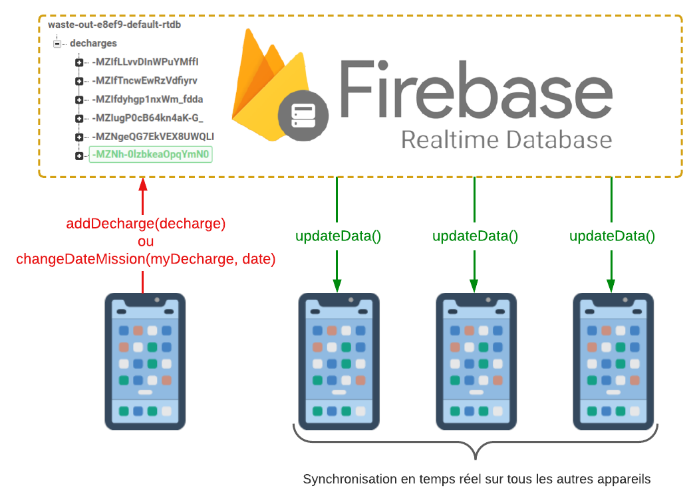

# WASTE OUT !

Concevoir une application qui permet de signaler et nettoyer les déchetteries sauvages dans la périphérie rennaise.

Objectif : Application communautaire pour signaler les lieux pollués à cause des déchets (Géolocalisation, Photos, descriptif, questionnaire) + Créer des actions pour nettoyer les décharges sauvages

## Fonctionnalités de l'application

Nous allons maintenant évoquer la mise en oeuvre de notre application. Chaque page contient une page Java avec ces différentes fonctionnalités. De plus, notre projet comporte 2 principaux objets : l'objet Décharge et l'objet Utilisateur comportant les caractéristiques de chaque objet. Dans cette partie, nous allons vous présenter 4 fonctionnalités indispensables à la réalisation de notre projet. Nous évoquerons, donc, la partie back-end avec le stockage des données puis nous détaillerons 2 fonctionnalités afin de signaler une décharge : ajouter une photo et localiser le lieu. Enfin, nous verrons l'affichage des décharges sur une carte.

### Stockage des données

Une fois l'application rendue uniquement utilisable avec son interface et ses fonctionnalités primaires, nous nous sommes confronté à un problème que l ’on n’avait pas envisagé : comment peut-on sauvegarder les caractéristiques d’une décharge afin qu’elles soient disponibles pour tous les utilisateurs ? Il fallait donc enregistrer toutes les caractéristiques de chaque décharge dans un service d’hébergement extérieur à Android Studio. Après des recherches afin de trouver le service d’hébergement le plus adapté à notre projet, nous nous sommes dirigés vers le service de Google : Firebase. Ce serveur nous permet, en effet, de stocker 1 GB de données avec un maximum de 100 connexions en simultanées gratuitement. Ces contraintes sont donc amplement suffisantes pour le début de notre projet. Le service proposé par Firebase est dans le langage de base de données NoSQL (Not only Structured Query Language signifiant, en français, pas seulement un l angage de requête structurée) qui est plus performant et possède une scalabilité plus importante que le langage traditionnel SQL. 

Nous avons donc utilisé cette base de données directement sur Android Studio en liant nos 2 projets afin d’ajouter un i tem “décharge” à la base de données et de le récupérer, plus tard, pour l ’afficher directement sur l’application. En effet, dès qu’un utilisateur signale une nouvelle décharge, l’instance de la décharge est envoyée directement à la base de données en temps réel de Firebase. Dans chaque item enregistré, on y retrouve donc les attributs utiles tels que :
- la date de signalement
- la date de la mission, initialisé à null
- la liste répertoriant les photos prises
- la latitude
- la longitude
- l’adresse exacte
- la ville
- la description faite par l’utilisateur
- la taille du dépôt
- la liste répertoriant les types de déchets présents
- les informations supplémentaires
- le nombre de participants à la mission, initialisé à 0

Les différentes décharges sont sauvegardées sur Firebase avec des identifiants uniques. Pour la question de la récupération des données, nous avons créé une liste comportant toutes les instances (décharge1, décharge2, etc.) afin de pouvoir les afficher aisément.

Ensuite, en plus d’ajouter et récupérer un item décharge depuis la base de données Firebase, nous pouvons aussi modifier un item “décharge”. En effet, dans notre application, un utilisateur peut créer une mission de nettoyage et donc, en validant la date, celle-ci est transmise automatiquement à la base de données pour modifier la date de la mission initialisé à null.

### Appareil photo

La partie photo est une fonctionnalité de la page de signalement qui permet d’ajouter une ou plusieurs photos représentatives de la déchetterie sauvage. Elle est divisée en deux parties :
- l’ajout d’une photo depuis l’appareil photo
- l’ajout d’une photo depuis la galerie du téléphone

Pour créer cette partie, il faut dans un premier temps demander à l’utilisateur la permission d’accès à l’appareil photo et à la galerie de son téléphone. Puis, il faut transférer la photo sur la page de signalement. Concernant la partie programmation, le code en java se divise en 2 parties :
- la fonction OnClick qui permet de gérer les permissions et la sélection de la photo choisie par l’utilisateur
- la fonction OnActivityResult qui permet de gérer l’affichage de la photo sur la page de l’application (un espace pour l’image est créé afin que l’image s’affiche au bon endroit et à la bonne taille)

S’il s’agit d’une photo prise depuis l’appareil photo, une fois la photo capturée, elle est transformée au format Bitmap. Puis, la photo est affichée sur l’application de l’utilisateur. Une fois que l’utilisateur a validé son signalement de déchetterie sauvage, la photo est stockée dans la base de données en codant l’image Bitmap en base 64.
S’il s’agit d’une photo choisie depuis la galerie de l’utilisateur, l’image est dans un premier temps au format URL. Puis la photo est affichée sur l’application de l’utilisateur au format Bitmap. Enfin, comme avec la partie appareil photo, l’image est convertie puis stockée dans la base de données au format base 64.
C’est grâce à ce processus que l’image passe du smartphone de l’utilisateur au serveur de l’application. Ainsi, l’image est définie en icône de la déchetterie sauvage à traiter. L’image est donc visible par tout le monde et la circulation des images est donc fonctionnelle.

### Carte

Lorsque l ’utilisateur souhaite visionner ou signaler une décharge, i l a besoin d’une carte avec des repères. C’est très précisément ce qu’il a fallu créer grâce à un squelette de base, qui i ntégrait l a création d’un fichier XML pour l a partie visuelle et Java pour l a l ogique. Il a fallu créer et remplacer dans notre code une clé API donnant accès à une copie de Google maps avec seulement l es fonctionnalités basiques. De cette façon, une seule clé permet d’afficher l a carte pour tous l es utilisateurs de notre application. Cela n’a pas été sans problème car nous ne savions pas au départ si une clé suffisait ou non et des tests furent nécessaires. Le code a donc été remanié à plusieurs reprises.

La seconde fonctionnalité apportée sur cette page est celle du pointeur qui au départ était sur l’Australie. Désormais, il se situe sur Rennes. La géolocalisation est aussi disponible avec le point bleu s’orientant en fonction de la position. On peut également faire pivoter la carte rotative en longitude et latitude pour l’orienter comme une boussole. Une barre de recherche pour les villes et communes a également été rajoutée. Des icônes pour basculer d’une page à l’autre peuvent également être disponibles en blanc ou noir pour plus ressortir et contraster avec la carte comme le titre pour plus de visibilité.

### Localisation

Au moment où l’utilisateur signale une mission, nous devons récupérer sa position afin de localiser le plus précisément possible le dépôt sauvage. En effet, la plupart du temps, les plus grands dépôts sauvages se trouvent en campagne dans un endroit caché où les personnes peuvent déposer des déchets sans être vues. Ces lieux sont, donc, souvent loin de la ville et très difficile à situer exactement. C’est pourquoi nous demandons à l’utilisateur si l’on peut activer sa position seulement pour cette fois ou à chaque fois qu’il signale un dépôt sauvage afin de récupérer les valeurs de latitude et longitude exactes.
